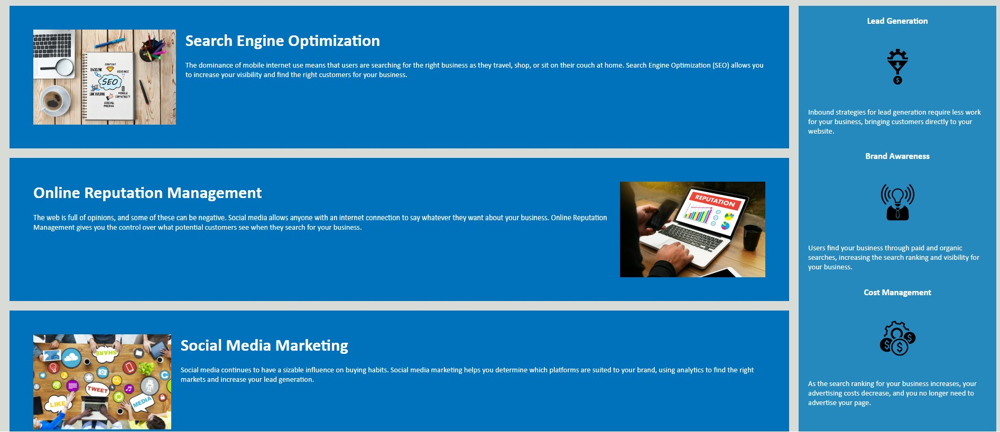

# HoriseonMarketing

## Description
This project is a refactored version of an existing website for Horiseon, a marketing agency that offers services such as search engine optimization, online reputation management, and social media marketing. The goal of this project is to make the website more accessible for users with disabilities and improve its performance and SEO.

## Installation
To install this project, you need to have a code editor such as Visual Studio Code and a web browser such as Google Chrome. You can download the project files from this repository and open them in your code editor. To view the website, you can either use the Live Server extension in Visual Studio Code or open the index.html file in your web browser.

## Usage
The website consists of a header, a hero image, a main content section, and a footer. The header contains the logo and the navigation menu, which allows the user to jump to different sections of the website. The hero image is a large background image that showcases the company's vision. The main content section contains three articles that describe the services offered by the company, and a sidebar that contains three benefits of working with the company. The footer contains the company's name and some icons.

The website uses semantic HTML tags to define the structure and meaning of the content, such as `<header>`, `<nav>`, `<article>`, and `<footer>`. It also uses CSS variables to store common values, such as colors, fonts, and sizes, and classes to group common styles and avoid repetition. The website also has a descriptive title, meaningful and descriptive `alt` attributes for images, and comments to explain the purpose and function of the code.

Here are some screenshots of the website:

## License
This project is licensed under the MIT License. See the [LICENSE] file for more details.